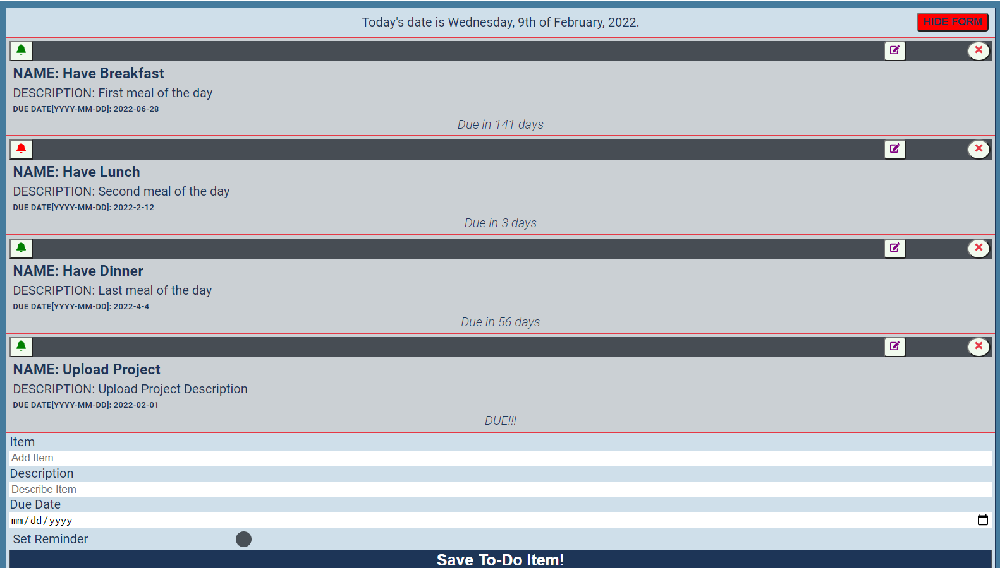

# The React Framework - ToDo List Solution

## Overview

This project provides a structured organization of tasks/thoughts/ideas that need to be attended to at a later time.

### The Manual

Users of this todo-list App should be able to:

- View the optimal layout for the component depending on their device's screen size
- view the current date and day of the week
- Observe that each todo item on the list has the following fields: Name, Short Description, and Due date
- Observe that each todo item automatically calculates the amount of days left before item is due
- Edit and Delete each Item individually
- Use toggleable reminder feature is also included for each item.

### todo list Screenshot

### Links

- Solution URL: [Please click here!](https://calculator-r.vercel.app)

## Thanks for your time!

### Built with:

- Semantic HTML5 markup
- CSS custom properties
- SCSS
- Flexbox
- Mobile-first workflow
- [React](https://reactjs.org/) - JS library

### Author: Kelvin Echenim.
